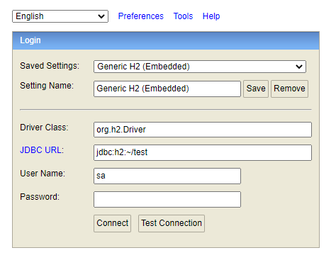

School registration system
---
Design and implement simple school registration system
- Assuming you already have a list of students
- Assuming you already have a list of courses
- A student can register to multiple courses
- A course can have multiple students enrolled in it.
- A course has 50 students maximum
- A student can register to 5 course maximum

## Doc 📖️

### API Specification

** in progress **

### Pre-requirements
* Java 11

## Develop

  1) Run the **Application.java** to access DB H2 Console

    http://localhost:8080/h2-console

  2) Use the following access:

    jdbc url: jdbc:h2:file:/data/demo;DB_CLOSE_ON_EXIT=FALSE
    user: sa
    pass: password

